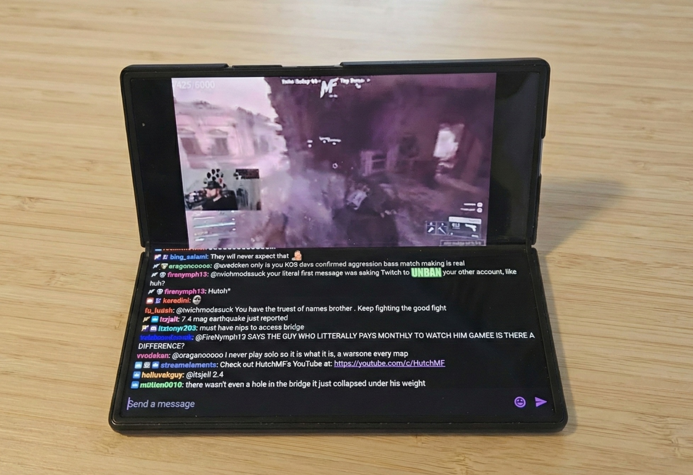
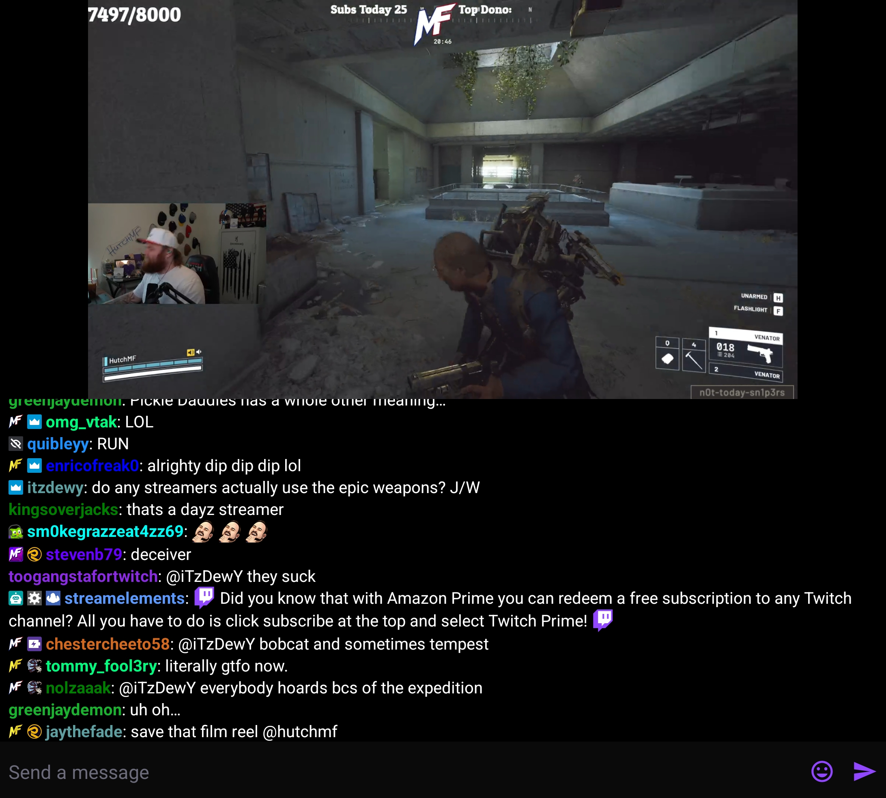

<h1> Twire Flex</h1>

Twire Flex is an enhanced fork of [Twire](https://github.com/twireapp/Twire) with **Flex Mode support** for foldable devices like the Samsung Galaxy Fold series.

## What's New in Twire Flex

### 🔄 Flex Mode Support
Optimized layout for foldable devices in "tabletop mode" (half-folded with horizontal hinge):
- **Video on top half** - Perfect viewing angle when device is propped up
- **Chat on bottom half** - Interactive chat easily accessible
- **Automatic detection** - Seamlessly switches when you fold/unfold
- **Smooth animations** - Polished transitions between modes
- **Toggle in settings** - Enable/disable flex mode as needed
- **Additional Themes** - I highly recommend Twitch OLED

Perfect for hands-free Twitch viewing on foldable devices!

---

Twire is an open source, ad-free Twitch browser and stream player for Android.

This is a fork of [Twire](https://github.com/twireapp/Twire), which itself is a fork of the [Pocket Plays for Twitch](https://github.com/SebastianRask/Pocket-Plays-for-Twitch) Android application.

## Current features

### Twire Flex Exclusive
- **Flex Mode for foldables** - Optimized split-screen layout for tabletop mode

### Inherited from Twire
- Built-in adblock
- VODs with chat replay
- Custom emotes (BTTV, FFZ and 7TV)
- Picture in Picture mode
- Highly customizable UI
- Twitch account support

## Images

[](Desk_Twire_Flex.jpg)

*Twire Flex in action - showing Flex Mode on Galaxy Z Fold*

[](Screenshot_Twire_Flex.jpg)

*Screenshot showing actual implementation*


## Making contributions

Developers are welcome to contribute to the project.

The easiest way to contribute is by reporting issues. The other way involves making pull requests, which requires you to have a proper IDE installed (such as [Visual Studio Code](https://code.visualstudio.com/)) and a copy of the repository.

To clone the repository, run the following commands:
```bash
git clone https://github.com/derek-depriest/twire-flex
cd twire-flex
```
If you ever need to update your copy to the latest version, run:
```bash
git pull
```
If you'd like to learn more about making a pull request, please read [this GitHub article](https://docs.github.com/en/pull-requests/collaborating-with-pull-requests/proposing-changes-to-your-work-with-pull-requests/creating-a-pull-request).

### Translations

Translators can help translate Twire over on [Weblate](https://hosted.weblate.org/engage/twire/).

## Licensing

Twire is licensed under the [GNU v3 Public License.](https://github.com/Perflyst/Twire/blob/master/LICENSE)

As this is a fork under GNUv3, other developers were involved.
Copyright notice for: [SebastianRask](https://github.com/SebastianRask), [alexzorin](https://github.com/alexzorin)
